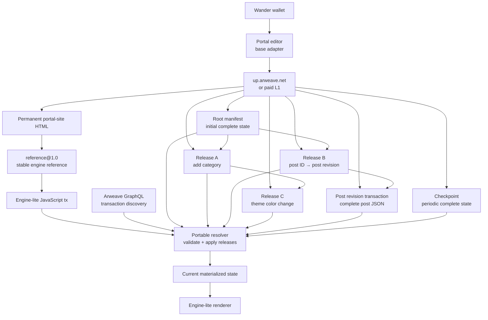

# Base Portal Architecture

Base mode implements Portal entirely with signed, immutable Arweave transactions. It does not require an AO process for portal creation, editing, authorization, discovery, state reconstruction, or public rendering.

The architecture separates four concerns:

- A permanent HTML site transaction provides a stable public entry point.
- A mutable `reference@1.0` selects the current engine-lite JavaScript transaction.
- An immutable manifest, release, and checkpoint log represents portal state.
- Separate post and media transactions keep large content out of portal releases.

The current state is a materialized view produced by validating and replaying the portal's transaction log.

The design has five core invariants:

- Portal content and authority can be reconstructed without local storage, Portal's backend, or an AO process.
- Every accepted state transition is attributable to the Arweave wallet that signed it.
- The root owner and portal identity cannot change after creation.
- Small edits upload small releases; large post and media bodies remain separate immutable transactions.
- Caches may improve availability and speed, but they never grant authority or replace validation.

## Architecture Overview



The `portal-site` transaction is executable HTML. Materialized portal state exists only in memory, local caches, or a checkpoint.

## Base Mode Boundary

Base mode is selected at build/runtime with `VITE_PORTAL_MODE=base`. Its persistence adapter exposes process-shaped methods to the existing editor, but those methods translate operations into Arweave reads and writes rather than AO messages.

The adapter is a compatibility boundary: editor code can continue calling zone, asset, role, and state methods, while base mode maps those calls to manifests, releases, post revisions, and membership transactions. Synthetic return values used to satisfy a process-shaped interface are not persisted authority and must not be treated as Arweave transaction IDs unless they pass the 43-character ID check.

Base mode supports:

- Portal creation and editing
- Post creation, editing, publishing, and deletion
- Categories, topics, themes, fonts, layout, and pages
- Featured posts
- Media uploads
- Administrator and contributor invitations
- WordPress and Markdown imports

AO-backed capabilities are omitted from the base-mode UI, including moderation, comments, tips, cross-posting, domains, ownership transfer, and profile editing. The existing process-mode implementations remain in the codebase.

Engine-lite resolves base state directly from the portable resolver.

## Identifier Model

Several IDs participate in a portal, and they are not interchangeable:

| Identifier                  | Meaning                                                                      | Mutability                 |
| --------------------------- | ---------------------------------------------------------------------------- | -------------------------- |
| `portalId`                  | Stable logical identity used in tags, URLs, releases, and membership records | Permanent                  |
| `siteTxId`                  | Executable `portal-site` HTML transaction                                    | Permanent                  |
| `rootTxId`                  | First valid full portal manifest and immutable authorization root            | Permanent                  |
| `manifestTxId` / `headTxId` | Most recently applied manifest, release, or checkpoint                       | Changes as state advances  |
| `checkpointTxId`            | Latest trusted full-state checkpoint                                         | Changes periodically       |
| `postId`                    | Stable identity of a post across edits                                       | Permanent                  |
| `postTxId`                  | Current complete revision transaction for a post                             | Changes on every post save |
| `engineReferenceId`         | Stable mutable reference selecting engine-lite                               | Permanent                  |
| Engine transaction ID       | Current immutable JavaScript bundle selected by the reference                | Changes on engine releases |

For newly created portals, the initial `siteTxId` is also used as the `portalId`, so opening `https://arweave.net/<portalId>` loads the site shell directly.

## Portal Creation

Creating a new base portal performs these writes in order:

1. Upload the small `portal-site` HTML shell.
2. Use the resulting site transaction ID as both `portalId` and `siteTxId`.
3. Build the initial full `portal-manifest` with the owner as an `Admin`.
4. Upload the root manifest tagged with the portal ID and owner.
5. Cache the materialized manifest locally and record the portal as accepted for its owner.
6. Track the site and manifest transactions as pending until they are cold-loadable.

The site shell and root manifest are separate because the public HTML must remain small and executable, while portal state must remain independently discoverable and updateable.

## Public Site and Engine Loading

The permanent site transaction contains a minimal document with a `#portal` mount point and a bootloader. It does not contain the portal's current content.

The bootloader:

1. Reads the stable engine reference ID embedded in the site HTML.
2. Queries Arweave GraphQL for the `reference@1.0` initialization transaction and its updates.
3. Establishes the immutable reference authority from the initialization transaction.
4. Ignores updates not signed by that authority or with an older timestamp.
5. Selects the newest valid `reference-value`, which is an engine JavaScript transaction ID.
6. Caches that engine transaction ID in `localStorage`.
7. Loads the JavaScript from the current gateway, retrying through `arweave.net` if needed.

If reference resolution fails completely, the shell loads the last cached engine or its embedded fallback engine transaction. If a reference update has not yet been indexed, GraphQL can temporarily return the previous valid engine value until the next refresh.

Once loaded, engine-lite determines the logical portal ID from, in order:

1. The `portal` or `portalId` query parameter
2. The first path segment
3. A portal ID embedded in the hash route

Engine-lite then invokes the same portable base resolver used by external consumers such as `ao-site`, applies themes and fonts, excludes draft or future-dated posts, and renders the feed or post route.

### Engine Upgrade Lifecycle

Portal content, the public site shell, and the rendering engine have independent lifecycles:

1. A new engine-lite bundle is uploaded as an immutable JavaScript transaction.
2. The `reference@1.0` authority publishes a signed reference update selecting that transaction.
3. Existing portal-site transactions discover the update without being re-uploaded.
4. The previous engine remains a valid fallback while the update is indexed or if the new bundle cannot be fetched.

Updating the engine reference changes code selection, not portal state. Portal releases never need to contain or update the engine bundle.

## Transaction Types

| `Type` tag          | Purpose                                               | Body                   |
| ------------------- | ----------------------------------------------------- | ---------------------- |
| `portal-site`       | Permanent public HTML and engine-reference bootloader | HTML                   |
| `portal-manifest`   | Initial complete portal state                         | Complete manifest JSON |
| `portal-release`    | Small portal delta or post-revision pointers          | Release JSON           |
| `portal-checkpoint` | Trusted periodic complete materialized state          | Checkpoint JSON        |
| `portal-post`       | Complete current revision of one post                 | Post JSON              |
| `portal-media`      | Uploaded image or other media                         | Original bytes         |
| `portal-membership` | A user's signed acceptance or departure record        | Membership JSON        |

All base transactions include `Portal-Mode: base`. State transactions also include `Portal-Id`; releases and checkpoints include `Portal-Root` and `Previous-Tx` where applicable.

### Discovery Tags

Transaction bodies are authoritative, while tags are the discovery index used to find candidate transactions. Resolvers must validate the body and signer after a tag match.

| Transaction   | Important tags                                                                                                                 |
| ------------- | ------------------------------------------------------------------------------------------------------------------------------ |
| Site          | `Portal-Mode`, `Type`, `Portal-Owner`, `Engine-Reference`, `Author`                                                            |
| Root manifest | `Portal-Mode`, `Type`, `Portal-Id`, `Portal-Owner`, `Engine-Reference`, `Portal-User`                                          |
| Release       | `Portal-Mode`, `Type`, `Portal-Id`, `Portal-Root`, `Previous-Tx`, `Author`; newly invited addresses also receive `Portal-User` |
| Checkpoint    | `Portal-Mode`, `Type`, `Portal-Id`, `Portal-Root`, `Previous-Tx`, `Portal-Owner`, `Author`                                     |
| Post revision | `Portal-Mode`, `Type`, `Portal-Id`, `Author`; later revisions also include `Post-Id`                                           |
| Membership    | `Portal-Mode`, `Type`, `Portal-Id`, `Portal-User`, `Membership-Status`, `Author`                                               |
| Media         | `Portal-Mode`, `Type`, `Author`; portal association lives in the state that references the media ID                            |

The initial site transaction cannot tag itself with its future transaction ID. Likewise, the first post transaction cannot tag itself with its future stable post ID. These relationships are completed by the root manifest or the following release.

## Manifest State Model

Schema version `2.1.0` currently materializes these major fields:

- Identity: portal, site, root, current manifest, checkpoint, and engine-reference IDs
- Metadata: name, description, banner, icon, and wallpaper
- Authorization: immutable owner and current user-role grants
- Navigation: categories, topics, links, and domains
- Presentation: pages, fonts, themes, layout, and post-preview settings
- Content indexes: posts, featured posts, and media uploads
- Checkpoint counters: releases, bytes, and transaction IDs since the checkpoint

`manifestTxId` identifies the transaction that produced the current materialized view. A release becomes the new head even though its body contains only changes rather than a complete manifest.

### Storage Strategy by Field

| State                                                          | Write representation                                                       |
| -------------------------------------------------------------- | -------------------------------------------------------------------------- |
| Name, description, banner, icon, and wallpaper                 | Scalar set/delete patch                                                    |
| Layout (`blog` or `docs`)                                      | Scalar set patch                                                           |
| Users, categories, topics, links, domains, themes, and uploads | Identity-based item patches where possible                                 |
| Pages, fonts, and post-preview settings                        | Leaf patches, array operations, or complete field replacement when smaller |
| Featured posts                                                 | Complete selection for setting; item removal for clearing                  |
| Post index                                                     | Stable post ID to immutable revision transaction pointer                   |
| Post content and frontmatter                                   | Complete separate `portal-post` revision                                   |
| Media bytes                                                    | Complete separate `portal-media` transaction                               |
| Checkpoint counters                                            | Derived during replay and persisted in checkpoints                         |

The diff generator compares the serialized size of a patch against a complete replacement for scalar or anonymous structures. This avoids turning a tiny edit into a large release while also avoiding patches that cost more than the value they replace.

## Upload Routing and Cost

Every base-mode write is signed by the connected Wander wallet.

- Payloads at or below 100,000 bytes are signed as ANS-104 data items and posted directly to `https://up.arweave.net/tx/arweave`.
- Payloads above 100,000 bytes are uploaded as layer-one Arweave transactions and paid for in AR.

This selection applies to site shells, manifests, releases, checkpoints, posts, membership records, and media. Most release transactions and engine bundles are below the free threshold. Large media and unusually large checkpoints or post revisions can require AR.

The returned transaction ID is validated before the write is accepted locally.

## Write Lifecycle

A normal editor write follows this sequence:

1. Load the freshest materialized portal state available.
2. Verify the connected wallet's permission for the requested operation.
3. Compute a compact release change or create a separate content transaction.
4. Apply the proposed change locally as a validation preview.
5. Sign and upload the required transaction or transactions.
6. Update the in-memory and local materialized-state caches immediately.
7. Add new transaction IDs to the pending index.
8. Refresh only the affected editor state field.
9. Wait for GraphQL indexing and gateway body availability before declaring the transaction cold-loadable.

Writes targeting the same portal in one browser are serialized through an in-memory queue. This prevents a second local save from accidentally using a stale head while the first save is still being uploaded.

## Root Manifest

Portal creation uploads one complete `portal-manifest` containing the initial:

- Owner and users
- Categories and topics
- Themes, fonts, layout, and pages
- Media index
- Posts index
- Featured posts
- Portal metadata

That transaction becomes the immutable `Portal-Root`. It is never overwritten.

## Release Transactions

A release contains portal identification and only the changes made by an action:

```json
{
	"type": "portal-release",
	"mode": "base",
	"portalId": "PORTAL_ID",
	"rootTxId": "ROOT_MANIFEST_TX",
	"previousTxId": "STATE_THIS_EDIT_USED",
	"authorAddress": "AUTHOR_WALLET",
	"generatedAt": "2026-08-14T00:00:00.000Z",
	"changes": {
		"patches": []
	}
}
```

Each release is tagged with `Portal-Id`, `Portal-Root`, `Previous-Tx`, and `Author`, allowing the resolver to discover it without interacting with an AO process.

The release's `previousTxId` records the state used to create the edit. It does not need to remain the single latest head forever: concurrent releases may refer to the same accepted predecessor.

## Patch Format

Portal collections and objects use four compact operations:

- `s`: Set or upsert a value
- `d`: Delete a value
- `p`: Splice part of an anonymous array
- `m`: Move an identified array item to a new index

Adding the first category can produce a patch like:

```json
{
	"patches": [
		[
			"s",
			["categories", ["=", "id", "category-123"]],
			{
				"id": "category-123",
				"name": "Development",
				"metadata": {}
			}
		]
	]
}
```

The selector `["=", "id", "category-123"]` means “the category whose ID equals this value.” If it does not exist, `s` appends it to the array.

Collections use stable identity fields such as `id`, `address`, `name`, `slug`, or `value`. This allows adding one category or user without uploading every existing entry.

For scalar or anonymous data, Portal compares the size of the patch representation with the complete replacement value and uploads whichever is smaller. Objects and identity-based collections favor leaf- or item-level patches to preserve merge behavior.

`featuredPosts` is a special case. Selecting a featured post replaces the complete selection so concurrent feature actions cannot accidentally merge into multiple featured posts. Clearing the selection uses an item-level removal.

## Post Revisions

Posts are handled separately because their content can be large.

1. Portal uploads a `portal-post` revision containing the complete current post JSON.
2. Portal uploads a small release that points the stable post ID at the new revision transaction.

```json
{
	"changes": {
		"posts": {
			"upsert": {
				"STABLE_POST_ID": "NEW_POST_REVISION_TX"
			}
		}
	}
}
```

Deleting a post uses:

```json
{
	"changes": {
		"posts": {
			"remove": ["STABLE_POST_ID"]
		}
	}
}
```

Portal releases therefore remain small. Each edited post revision currently contains the complete post rather than a block-level content delta.

For a newly created post, the first `portal-post` transaction ID becomes both its stable `postId` and initial `postTxId`. The following release maps that ID to itself. Later saves preserve the stable `postId`, upload a new `postTxId`, include the stable ID in the `Post-Id` tag and body, and point `previousTxId` at the preceding post revision. Post revision history is therefore independently traceable even though the portal index points only to the current revision.

Media remains in separate Arweave transactions and is referenced by transaction ID from portal or post state.

Post importers also register featured images in the portal's `uploads` collection. Existing Arweave image IDs are reused; external image URLs are uploaded once and the resulting transaction ID becomes both the post thumbnail and media-library entry.

## Concurrent Administrators

Suppose two administrators both load head `H0`:

```text
Admin A: H0 → release adding Category A
Admin B: H0 → release adding Topic B
```

Both releases can reference `H0`. The resolver treats releases as a merge log rather than requiring one winning linear branch:

1. Accept `H0`.
2. Accept every authorized release whose predecessor has already been accepted.
3. Apply accepted releases in Arweave/GraphQL order.
4. Merge item-level patches into the accumulated state.

Changes to different categories, posts, topics, or object properties merge naturally.

If two users update the exact same scalar or property, the release applied later wins. Conflicting deletion and modification results are also order-dependent. This is deterministic replay with merge-aware patches, not a conflict-free replicated data type.

Writes from one browser are serialized locally. Separate browsers can still create sibling releases that refer to the same predecessor.

## Authorization

Anyone can upload a transaction tagged as a portal release, but that does not make the transaction valid.

The resolver verifies:

- The immutable root transaction owner matches the owner recorded by the root manifest.
- `rootTxId` and `portalId` match the portal being resolved.
- `previousTxId` refers to an accepted or checkpointed transaction.
- The actual Arweave transaction signer matches `authorAddress`.
- The signer was authorized by the accumulated portal state at that point in the log.
- The signer is allowed to change every field included in the release.

Permissions are:

- **Root owner:** All portal changes and checkpoints
- **Admin:** Portal settings, users, posts, and uploads
- **Contributor:** Posts and uploads only
- **Unauthorized wallet:** Release is ignored

The signed Arweave transaction owner is authoritative. An attacker cannot grant themselves access by changing an `Author` tag or JSON field.

### Trust and Validation Boundaries

Arweave provides immutable bytes, transaction IDs, signatures, owners, tags, and block ordering. Portal adds the application-level rules that decide which of those immutable transactions belong to one valid state history.

Resolvers do not trust:

- GraphQL tags without checking the corresponding body
- `authorAddress` or `Author` without matching the transaction signer
- A manifest that claims a different root owner
- A checkpoint uploaded by an administrator instead of the immutable root owner
- Unknown release keys, malformed post pointers, or invalid transaction IDs
- Patch paths outside the supported portal fields
- Patch keys such as `__proto__`, `constructor`, or `prototype`

Only the root manifest is a trust anchor. GraphQL, gateways, caches, and pending records are replaceable transport and indexing layers. A consumer may use another gateway, but it must preserve these validation rules.

### Users, Invitations, and Membership

Authorization and membership acceptance are deliberately separate:

- The manifest's `users` array is the authorization source. An owner or admin changes it through an authorized release.
- Adding a user grants their roles in portal state and adds a `Portal-User` discovery tag to the release.
- The invited wallet discovers the portal by querying transactions tagged with its address.
- Accepting or leaving creates a `portal-membership` transaction signed by the invited wallet itself.
- Membership records determine whether the editor presents the portal as an invitation, an accepted portal, or a portal the user left.

Acceptance does not rewrite the portal manifest. A membership receipt proves the user's intent, while the administrator-signed `users` state determines what the wallet is allowed to change.

Leaving a portal changes membership presentation but does not revoke a wallet's on-chain role. An owner or administrator must remove that wallet from the manifest's `users` array to revoke write permission.

The owner is always normalized back into the users collection with the `Admin` role and cannot be removed by a later release.

Base mode uses the connected wallet address as identity. It does not require or update an AO profile. Portal membership IDs and recent accept/decline choices are cached locally so navigation remains usable while their transactions are being indexed.

### Role Enforcement

Permission checks happen twice:

1. The editor checks the current materialized role before allowing the write.
2. Every cold resolver independently validates the signed release against the roles that existed at the release's accepted position in history.

This second check is what prevents a forged client from bypassing the UI. A newly added administrator's releases become valid only after the role-granting release is accepted into reconstructed history.

## Checkpoints

The root owner publishes a checkpoint after either:

- 50 releases, or
- 250 KB of release data since the previous checkpoint

A checkpoint contains the complete materialized portal state and the IDs of releases already incorporated into it. It does not replace or change the immutable root.

On a cold load, the resolver:

1. Finds and validates the immutable root manifest.
2. Finds the newest valid checkpoint signed by the immutable root owner.
3. Starts with the full state stored in that checkpoint.
4. Fetches and applies only the release tail after the checkpoint.

Administrators can publish releases, but only the immutable root owner can create a trusted checkpoint. If the threshold is crossed through administrator or contributor writes, checkpoint creation waits until the owner's next successful write.

## Indexing and Pending Transactions

The browser that creates a release caches the transaction body and materialized portal state immediately. Another browser cannot discover it until:

- Arweave GraphQL indexes the release transaction.
- A gateway can load the release body.
- Any referenced post revision required by that release is loadable.

Media availability is independent of state replay. A manifest or release can resolve while a referenced image is still propagating; the UI should treat that as a temporarily unavailable asset rather than an invalid portal state.

If a release is indexed before a referenced post transaction, the resolver leaves that release unresolved rather than applying incomplete state. The pending-transactions indicator shows the missing release or referenced transaction until it becomes loadable.

Pending state comes from two sources:

- **Locally created transactions:** Recorded when the current wallet uploads them.
- **Observed dependencies:** Added when reconstruction discovers an indexed transaction body, predecessor, or post revision that prevents replay. Media IDs named by a blocked release may also be surfaced so asset propagation is visible.

The pending checker:

- Keeps at most 100 records for up to 24 hours.
- Queries transaction IDs in groups of nine to respect GraphQL's ID limit.
- Checks gateway bodies with concurrency capped at eight requests.
- Verifies JSON type and portal ID for state transactions.
- Retries with exponential backoff from 10 seconds to a maximum interval of 10 minutes.
- Removes a transaction only after it is both indexed and loadable from a cold browser.

Pending entries link to the transaction's Lunar explorer page so users can inspect propagation outside Portal.

Because observed dependencies are persisted locally, another administrator can see why newly discovered state has not yet appeared even if that browser did not create the transaction.

## State Reconstruction

The browser-compatible resolver performs the following process without AO:

1. Query Arweave GraphQL for `portal-manifest`, `portal-release`, and `portal-checkpoint` transactions tagged with the portal ID.
2. Locate the first valid root manifest with no predecessor.
3. Verify that the root transaction signer matches the manifest owner.
4. Select the newest valid checkpoint signed by the root owner.
5. Fetch the remaining release tail with bounded concurrency.
6. Repeatedly apply authorized releases whose predecessors are already accepted.
7. Load post revisions referenced by `posts.upsert` entries.
8. Return the complete materialized portal state and any unresolved transaction IDs.

Immutable transaction bodies are cached, so later resolutions do not need to download unchanged history again.

## Cache Layers

Caching improves responsiveness but is never an authorization source:

- **Materialized manifest memory cache:** Reuses recently resolved portal state for 10 seconds.
- **Request coalescing:** Concurrent reads of the same portal or transaction share one active request.
- **Browser `CacheStorage`:** Stores immutable manifest, release, checkpoint, and post bodies by gateway URL.
- **Local storage:** Stores the latest materialized manifest, latest known head, portal memberships, pending transactions, site mappings, and the last resolved engine transaction.
- **In-memory transaction cache:** Avoids decoding the same immutable body repeatedly during one session.

A fresh write attempts network reconstruction first but falls back to the locally cached manifest when the newest uploaded head has not yet entered GraphQL. A cold browser has no such fallback and must wait for indexing.

Clearing browser storage removes these performance and pending-state hints, but it does not remove portal content or authority. The portal can be reconstructed again from Arweave once all required transactions are indexed and loadable.

## Consistency and Visibility

Base mode is locally immediate and globally eventually consistent:

| View                                | When a successful write appears                                    |
| ----------------------------------- | ------------------------------------------------------------------ |
| Current editor tab                  | Immediately after signing and local validation                     |
| Same browser after navigation       | Usually immediately from cached materialized state                 |
| Same browser after clearing storage | After GraphQL and gateway propagation                              |
| Another administrator's browser     | After discovery, body availability, dependency loading, and replay |
| Public engine or external consumer  | After the same cold-resolution requirements are met                |

A transaction ID proves that bytes were signed and accepted by the upload endpoint; it does not prove that every GraphQL index or gateway can already serve those bytes. The pending UI exists to make this propagation window visible rather than presenting stale state as a save failure.

## Public Rendering Rules

Engine-lite turns materialized manifest posts into a read-only public site:

- Draft posts are excluded.
- Posts with future release dates are excluded until their date arrives.
- Posts are ordered newest first.
- The stable post slug or ID selects an individual post route.
- The scalar layout selects either the blog feed or a Lunar-style documentation view with category navigation, an on-page table of contents, and previous/next links.
- The portal's active theme, configured fonts, icon, featured-post list, categories, and post JSON blocks drive rendering.
- Posts without images receive alternating deterministic gradients derived from the active site colors.
- A shared site shell renders the portal logo, an optional Wander connection button, and the site title in the footer.
- Wallet-address post authors link to their Lunar explorer page.
- Page title, description, Open Graph, Twitter, and favicon metadata are set in the browser.
- The editor preview uses the same engine-lite post normalization, renderer, CSS, theme variables, and font loading.

The public engine never saves portal data and does not require a wallet. Connecting Wander is optional and currently establishes only the visitor's address for future interactive features.

Rich HTML inside supported post blocks is sanitized before rendering: executable elements, inline event handlers, and JavaScript URLs are removed. Unsupported process-only or monetization blocks may remain in stored JSON for compatibility but are not rendered by engine-lite.

## Failure and Recovery Behavior

The architecture favors ignoring incomplete or invalid data rather than partially applying it:

- An invalid root means the portal cannot be resolved.
- A release with the wrong portal, root, signer, author, permissions, or predecessor is ignored.
- A release that references a missing post revision remains unresolved and is retried later.
- A checkpoint not signed by the immutable root owner is ignored.
- Failure to create a checkpoint does not invalidate the release that triggered it.
- A temporary GraphQL failure can fall back to cached editor state, while a cold public load shows an error until discovery recovers.
- An engine-reference update continues serving the previous valid engine until its update is indexed.
- A failed engine-reference lookup uses the cached or embedded fallback engine transaction.

No transaction is overwritten or deleted during recovery. New releases, checkpoints, membership receipts, site shells, and engine-reference updates advance the system by adding signed immutable transactions.

## Performance Characteristics

- GraphQL discovery is paginated at 100 transactions per page.
- Immutable transaction bodies are loaded with concurrency capped at eight.
- A valid checkpoint avoids replaying all releases incorporated into it.
- Only the release tail, newly referenced posts, and uncached immutable bodies require network downloads.
- Portal field refreshes are selective in the editor, avoiding complete state reloads after every action.
- A portal with no usable checkpoint becomes progressively slower to cold-load as its release history grows.

Checkpointing bounds release replay, but a checkpoint is itself a complete state upload. Large media is never embedded in the checkpoint; it remains referenced by transaction ID.

## Schema Evolution and Compatibility

`schemaVersion` identifies the state format; the current version is `2.1.0`. Readers normalize missing optional fields to safe defaults so older base manifests remain loadable. Release readers accept only the explicit change-key and patch-operation allowlists for the version they understand.

Evolution should follow these rules:

- Add optional manifest fields with deterministic defaults.
- Add new release operations only after the editor, in-app resolver, portable resolver, and engine-lite all understand them.
- Keep old transaction types and readers available; immutable history cannot be migrated in place.
- Never reinterpret an existing patch opcode or field with different semantics.
- Make public consumers ignore presentation features they cannot render, but never weaken authorization validation.
- Update `scripts/resolve-base-portal.mjs` in the same change as any state, permission, checkpoint, or replay rule.

## External Dependencies and Availability

Base mode has no AO dependency, but it is not network-independent:

- Wander supplies the active address and Arweave signatures.
- `up.arweave.net` accepts signed small data items.
- An Arweave gateway accepts paid layer-one transactions and serves immutable bodies.
- Arweave GraphQL indexes tags, owners, block metadata, and transaction IDs for discovery.
- The engine `reference@1.0` log must be discoverable to select upgrades; the site embeds a fallback for outages.

If GraphQL is unavailable, known immutable transaction IDs and cached state may still load, but a cold consumer cannot discover an unknown release tail. If a gateway is unavailable, clients can retry through another gateway without changing portal identity or state semantics.

## Known Tradeoffs

- Post revisions contain a complete post, not block-level post deltas.
- Same-field concurrent conflicts are resolved by accepted replay order rather than interactive conflict resolution.
- Transactions returned at the same block height currently rely on the gateway's GraphQL ordering. A protocol-level transaction-ID tie-breaker would provide stronger cross-gateway ordering guarantees for same-field conflicts.
- GraphQL indexing is required for cross-device discovery even when a transaction body is already available by ID.
- The first cold load can require several immutable transaction requests; caches make later loads cheaper.
- Only the immutable root owner can publish trusted checkpoints, so a portal maintained exclusively by other admins can accumulate a long tail until the owner writes again.
- Existing site shells embed a fallback engine transaction from their creation time. The mutable engine reference normally supersedes it, but that fallback remains old if reference resolution and the browser engine cache are both unavailable.

## Portable Consumer Integration

`scripts/resolve-base-portal.mjs` has no Node-only or Portal UI dependencies. It can be copied or imported by browser applications such as `ao-site`:

```javascript
import { resolvePortalState } from './resolve-base-portal.mjs';

const portal = await resolvePortalState(PORTAL_ID, {
	transactionCache: new Map(),
	concurrency: 8,
});
```

The returned object includes the materialized portal fields plus:

- `portalId`
- `rootTxId`
- `headTxId`
- `checkpointTxId`
- `resolvedReleaseCount`
- `unresolvedTransactions`

Consumers should render only after resolution completes and should surface `unresolvedTransactions` when the portal is temporarily incomplete.

The resolver accepts a logical portal ID or any base state transaction whose body names the logical portal ID. It is intentionally read-only: consumers do not need Portal UI code, wallet APIs, AO libraries, or local storage to reconstruct state.

## Implementation

- Portal write path and in-app resolver: [`src/helpers/basePortal.ts`](../src/helpers/basePortal.ts)
- Portable browser/Node resolver: [`scripts/resolve-base-portal.mjs`](../scripts/resolve-base-portal.mjs)
- Pending transaction tracking: [`src/helpers/pendingTransactions.ts`](../src/helpers/pendingTransactions.ts)
- Arweave upload selection: [`src/helpers/upload.ts`](../src/helpers/upload.ts)
- Portal-site bootloader template: [`src/helpers/config.ts`](../src/helpers/config.ts)
- Engine-lite state adapter: [`src/apps/engine-lite/data.ts`](../src/apps/engine-lite/data.ts)
- Engine-lite renderer and sanitization: [`src/apps/engine-lite/render.ts`](../src/apps/engine-lite/render.ts)
- Editor engine-lite preview: [`src/apps/engine-lite/preview.tsx`](../src/apps/engine-lite/preview.tsx)
- Engine publishing and reference update: [`scripts/publish-engine-lite.mjs`](../scripts/publish-engine-lite.mjs)
